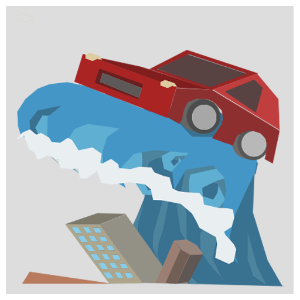

# Flood Racer

## Vision Statement

Flood Racer is a endless racing game where you have to escape a giant tsunami wave through a breathtaking low-poly city.

## Project

The game was created in Unity during the GamesAcademyBerlin-GameJam 2019. The Theme of the Game Jam was "Flood".

## My Work

I was responsable for the programming part.

## Links

[itch.io](https://jonas-7.itch.io/flood-racer)

