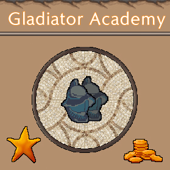

# Gladiator Academy

## Vision Statement

The Gladiator Academy has an ongoing competition with the School for Gladiators. You are hired as the new manager and the Academy’s fate lies in your hands. Train your Gladiators for upcoming arena battles, cure your survivors or recruit fresh meat to raise the Academy’s Glory.

## Project

This game emerged from an internal Game Jam at Games Academy which happened to start at the same time as Ludum Dare 45, so the same theme was chosen: Start with nothing. After our internal 48h we chose to work a bit more on it and submit it at Ludum Dare.

## My Work

I chose to work at the front-end as we already had a back-end developer with more experience in this type of games.

## Links

[Ludum Dare](https://ldjam.com/events/ludum-dare/44/gladiator-academy)

