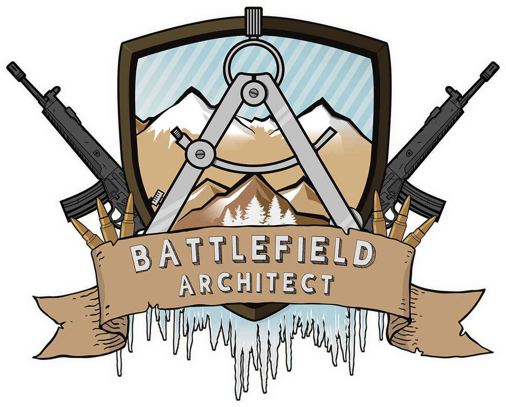

# Pew Pew -Battlefield Architect-

## Vision Statement

Battlefield Architect is a World War strategy Sim in which the player plays a planning / supporting role. Help your AI units by securing strategically important positions and facilitate their advancement into enemy territory.

## Project

[WIP]

## My Work

I worked as Lead Programmer and Vision Keeper. So I was responsible for all the documentation together with my producer. I also took on the role of Network Programmer and implemented the Network backbone on-top of the UDP Standard.
I was responsible for the Tick and Game-state implementation as it is very strongly tight to the Net code. In addition to that I have tried to help my two Programming colleagues as good as I could to ensure fast development.

## Links

[GitHub](https://github.com/Assertores/PewPew-BattlefieldArchitect-)

