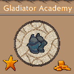
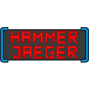

| [ABOUT ME](https://assertores.github.io/#game-designergame-programmer) | [GAMES](https://assertores.github.io/#games) | ONLINE PORTFOLIO | [CV](https://assertores.github.io/#CurriculumVitae) | [CONTACT](https://assertores.github.io/#contact) |
| ----- | ----- | ----- | ----- | ----- |

|  | ANDREAS EDMEIER |
| ----- | ----- |

## GAME-DESIGNER/GAME-PROGRAMMER

Hi. I'm a Game Developer from Germany still in apprenticeship.

As for now I have experience with the programming languages c, c++ and c#.

Furthermore I worked with Unity, Godot, Git, SDL and Qt-Creator.

In my spare time I like to play some musical instruments for example Drums, Guitar and Violin.

## Games

| | |
| ----- | ----- |
|  | [WIP] **Pew Pew -Battlefield Architect-** This game was created as a third semester project as Gameprogrammer at the Games Academy. Battlefield Architect is a World War strategy sim in which the player plays only a planning / supporting role. Help your AI units by securing strategically important positions and help them advance into enemy territory.<!--  [More]() --> |
|  | **Pew Pew -Battle Colosseum-** This game was created as a second semester project as Gameprogrammer at the Games Academy. Pew Pew Battle Colosseum is a funny 2D PvP Shooter in a distinct comic book style arena. Use the recoil of your weapon to navigate through a low gravity environment and shoot your opponents down.<!--  [More]() --> |
|  | **Gladiator Academy** This game was created as part of a 48h internal Games Academy gameJam. The Gladiator Academy has an ongoing competition with the School for Gladiators. You are hired as the new manager and the Academy’s fate lies in your hands. Train your Gladiators for upcoming arena battles, cure your survivors or recruit fresh meat to raise the Academy’s Glory.<!--  [More]() --> |
|  | **V.I.R.U.S** This game was created as a second semester project as Gamedesigner at the Games Academy. V.I.R.U.S is an isometric 3D stealth puzzler in which the player is a virus and tries to infiltrate a system. For this he uses different skills to trick security systems.<!--  [More]() --> |
|  | **Pirate arena** This game was created as part of a 48h internal Games Academy gameJam. A local 1on1 Pirate Seafight Game.<!--  [More]() --> |
|  | **Hammerjaeger** This game was created as a first semester project at the Games Academy. Instead of rats and mice, robots invade our homes. A former exterminator rises to be the hero to save humanity from destruction. His name is Hammerjaeger and with his mighty hammer he is the only one capable to put an end to the robot terror!<!--  [More]() --> |
|  | **Abteilung-F** This game was created as part of a 48h gameJam called FakeJam. You're an employee of the Free State Department of Communications and working there as a Fact Checker in the newly established Department F. Your job is to review posts from the public media on their veracity. Decide on this basis whether or not it is Fake News.<!--  [More]() --> |

## Curriculum Vitae

| Time | Subject |
| ----- | ----- |
| 04.2018 - Ongoing | **Games Academy**  - degree in Game Design and Game Programming.  - In Berlin |
| 04.2018 - 11.2018 | **Work on Abteilung-F**  - As a Game Designer and Programmer  - Exhibitor on a variety of exhibitions (Play18 Festival, GamesCom, Talk and Play) |
| 12.2013 - 04.2018 | **Volunteer firefighter**  - Voluntary service to the community in Neukirchen/Hirten (Bavaria)  - Bronze badge  - Truppmann I education |
| 09.2013 - 04.2018 | **Apprenticeship and Work at Schwanner GmbH**  - In Hirten (Bavaria)  - As Technical Draftsperson Subject Area: Steel and Metal Construction Engineering |
| 11.2017 | **Spiele Wiesn**  - Exhibitor in Munich (MOC)  - With a not yet published board game |
| 07.2013 - 12.2015 | **Learned C and C++**  - With the help of my best friend |
| 09.2007 - 07.2013 | **Realschule**  - In Altötting (Herzog-Ludwig Realschule) (Bavaria)  - Elective Subject: Mathematics, Natural Sciences and Technology |
| 02.2012 | **Jugend forscht**  - Exhibitor in Munich (EADS)  - With the Physical battery: a method to store electricity decentralised  - Special award for innovation. |

## Contact

E-mail: [assertores@web.de](assertores@web.de)
<!--
[//]: <> (===== ===== OLD ===== =====)
<table>
  <tr>
    <td><a href="https://assertores.github.io/#andreas-edmeier">HOME</a></td>
    <td><a href="https://assertores.github.io/#game-designergame-programmer">ABOUT ME</a></td>
    <td><h1>ONLINE PORTFOLIO</h1></td>
    <td><a href="https://assertores.github.io/#games">GAMES</a></td>
    <td><a href="https://assertores.github.io/#contact">CONTACT</a></td>
  </tr>
</table>
 
 
<table border="0">
  <tr>
    <td></td>
    <td><h1>ANDREAS EDMEIER</h1></td>
  </tr>
</table>
 
 
 
 
 
 
 
 
 
 
 

## 
GAME-DESIGNER/GAME-PROGRAMMER

Hi. I'm a Game Developer from Germany still in apprenticeship. 
  
As for now I have experience with the programming languages c, c++ and c#. 

Furthermore I worked with Unity, Godot, Git, SDL and Qt-Creator. 

In my spare time I like to play some musical instruments for example Drums, Guitar and Violin.

 
 
 
 
 
 
 
 
 
 
 

## 
Games

Here are some links to games on which I have worked on.

 
 
<table border="1|0">
  <tr>
    <td></td>
    <td>
<h3>Abteilung F</h3>

  

  
This game was created as part of a 48h gameJam called FakeJam.

  

You're an employee of the Free State Department of Communications and working there as a Fact Checker in the newly established Department F. Your job is to review posts from the public media on their veracity. Decide on this basis whether or not it is Fake News.

  

  <table align="center">
    <tr>
      <td><a href="http://royal2flush.itch.io/abteilung-f">to itch.io</a></td>
      <td><a href="http://abteilung-f.de/">to the website</a></td>
    </tr>
  </table></td>
  </tr>
  <tr>
    <td></td>
  <td>
<h3>Pirate arena</h3>

This game was created as part of a 48h internal Games Academy gameJam.

A local 1on1 Pirate Seafight Game.

<table align="center">
    <tr>
      <td><a href="https://pommelz.itch.io/pirate-arena">to itch.io</a></td>
    </tr>
  </table></td>
  </tr>
  <tr>
    <td></td>
  <td>
<h3>Hammerjaeger</h3>

This game was created as a first semester project at the Games Academy

The world has changed...

Instead of rats and mice, robots invade our homes. A former exterminator rises to be the hero to save humanity from destruction. His name is Hammerjaeger and with his mighty hammer he is the only one capable to put an end to the robot terror!

<b>Hammer ON!</b>

<table align="center">
    <tr>
      <td><a href="https://github.com/Assertores/HammerMan">to Github repo</a></td>
  </tr>
  </table></td>
  </tr>
</table>
 
 
 
 
 
 
 
 
 
 
 

## 
Contact

<a href="assertores@web.de">assertores@web.de</a>

