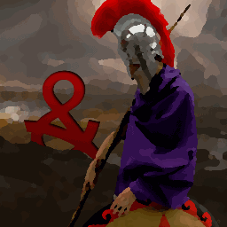
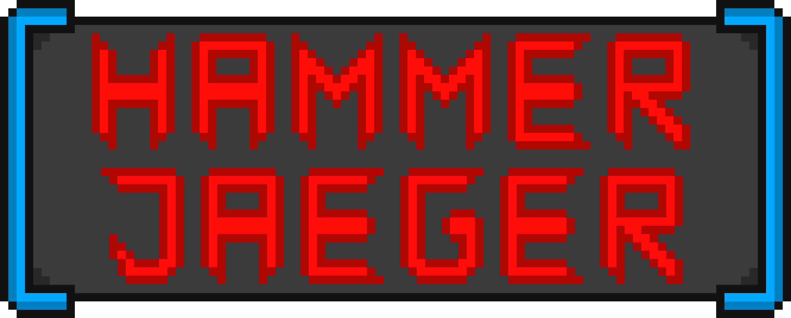

<table border="0">
  <tr>
    <td></td>
    <td><h1>ANDREAS EDMEIER</h1></td>
  </tr>
</table>
 
 
 
 
 
 

## 
GAME-DESIGNER/GAME-PROGRAMMER

Hi. I'm a Game Developer from Germany still in apprenticeship.

As for now I have experience with the programming languages c, c++ and c#.

Furthermore did I work with Unity, Git, SDL and Qt-Creator.

In my spare time I like to play some music instruments for example Drums, Guitar, Violin.

 
 
 
 
 
 

## 
Games

Here are some links to games on which I have worked on.

 
 
<table border="1|0">
  <tr>
    <td></td>
    <td>
<h3>Abteilung F</h3>

  

  
This game was created as part of a 48h gameJam called FaceJam.

  

You're an employee of the Free State Department of Communications and working there as a Fact Checker in the newly established Department F. Your job is to review posts from the public media on their veracity. Decide on this basis whether or not it is Fake News.

  

  <table border="0">
    <tr>
      <td><a href="http://royal2flush.itch.io/abteilung-f">to itch.io</a></td>
      <td><a href="http://abteilung-f.de/">to the website</a></td>
    </tr>
  </table></td>
  </tr>
  <tr>
    <td></td>
  <td>
<h3>Pirate arena</h3>

This game was created as part of a 48h intern Games Academy gameJam.

A local 1on1 Pirate Seafight Game.

<table border="0">
    <tr>
      <td><a href="https://pommelz.itch.io/pirate-arena">to itch.io</a></td>
    </tr>
  </table></td>
  </tr>
  <tr>
    <td></td>
  <td>
<h3>Hammerjaeger</h3>

This game was creaded as a first semester project on the Games Academy

The world has changed...

Instead of rats and mice, robots invade our homes. A former exterminator rises to be the hero to save humanity from destruction. His name is Hammerjaeger and with his mighty hammer he is the only one capable to put an end to the robot terror!

<b>Hammer ON!</b>

<table border="0">
    <tr>
      <td><a href="https://github.com/Assertores/HammerMan">to Github repo</a></td>
  </tr>
  </table></td>
  </tr>
</table>
 
 
 
 
 
 

## 
Contact

<a href="assertores@web.de">assertores@web.de</a>

